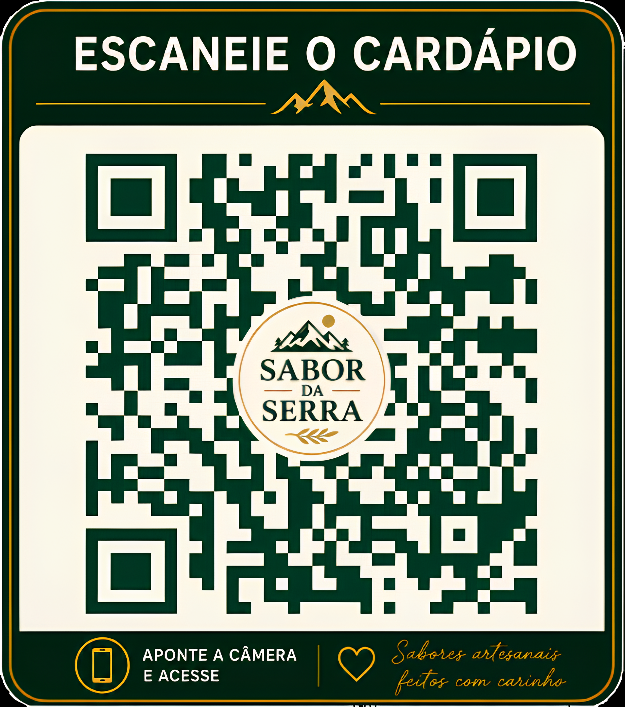

# Sabor da Serra

Demo de cardápio digital responsivo desenvolvida para demonstrar uma solução moderna para restaurantes.

## Demonstração online
https://demo-sabor-da-serra.netlify.app/

## QR Code

## Funcionalidades
- Cardápio digital responsivo
- Busca por produtos
- Filtros por categoria
- Favoritos
- Modal de detalhes
- Carrinho lateral
- Controle de quantidade
- Observações do pedido
- Integração com WhatsApp
- Configuração centralizada com `config.js`

## Tecnologias
- HTML5
- CSS3
- JavaScript
- LocalStorage
- Netlify

## Executar localmente
Basta abrir o arquivo `index.html` no navegador.

## Configuração
Os principais dados do restaurante ficam centralizados em `config.js`.

## Observação
Este projeto é uma demonstração. Avaliações, horários, contatos e demais dados comerciais podem estar configurados como demonstrativos.